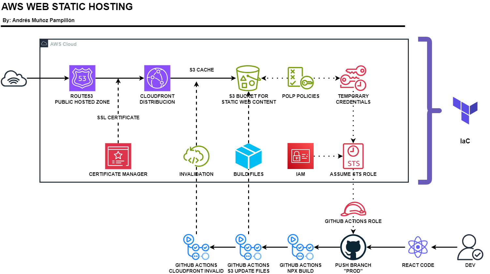

# AWS STATIC WEB HOSTING

This project demonstrates how to host a static website on AWS using a private S3 bucket. By leveraging Route 53, CloudFront, and AWS Certificate Manager, we ensure the website is secure, performant, and easily accessible via a custom domain.

### Architecture

1. **Amazon S3**:
   - Stores the static content of the website.
   - Configured as a private bucket to enhance security.

2. **Amazon Route 53**:
   - Manages the domain registration.
   - Provides DNS routing to the CloudFront distribution.

3. **Amazon CloudFront**:
   - Distributes the static content globally, reducing latency.
   - Improves website performance and security.
   - Uses SSL/TLS certificates from AWS Certificate Manager for secure connections.

4. **AWS Certificate Manager**:
   - Issues and manages the SSL/TLS certificates for the custom domain.
   - Ensures secure HTTPS connections to the website.

This setup ensures a secure, scalable, and highly available static website hosted on AWS.



## Register Domain in Route 53

In order to deploy the website with a custom domain, we first need to register (purchase) the domain. This can be done directly in AWS Route 53, and the cost may vary based on the TLD (Top-Level Domain). Of course, the domain must be available. Let's break down each step.

### Check Domain Availability

With this command, you can check through the AWS CLI if the domain is available:
```sh
aws route53domains check-domain-availability --region us-east-1 --domain-name example.com
```
### Check domain availability

If you want to register the domain, you can run this command:
```sh
aws route53domains register-domain --region us-east-1 --cli-input-json file://register-domain.json
```
Make sure that the `register-domain.json` contains the following information with your data.
```json
{
    "DomainName": "example.com",
    "DurationInYears": 1,
    "AutoRenew": true,
    "AdminContact": {
        "FirstName": "Martha",
        "LastName": "Rivera",
        "ContactType": "PERSON",
        "OrganizationName": "Example",
        "AddressLine1": "1 Main Street",
        "City": "Anytown",
        "State": "WA",
        "CountryCode": "US",
        "ZipCode": "98101",
        "PhoneNumber": "+1.8005551212",
        "Email": "mrivera@example.com"
    },
    "RegistrantContact": {
        "FirstName": "Li",
        "LastName": "Juan",
        "ContactType": "PERSON",
        "OrganizationName": "Example",
        "AddressLine1": "1 Main Street",
        "City": "Anytown",
        "State": "WA",
        "CountryCode": "US",
        "ZipCode": "98101",
        "PhoneNumber": "+1.8005551212",
        "Email": "ljuan@example.com"
    },
    "TechContact": {
        "FirstName": "Mateo",
        "LastName": "Jackson",
        "ContactType": "PERSON",
        "OrganizationName": "Example",
        "AddressLine1": "1 Main Street",
        "City": "Anytown",
        "State": "WA",
        "CountryCode": "US",
        "ZipCode": "98101",
        "PhoneNumber": "+1.8005551212",
        "Email": "mjackson@example.com"
    },
    "PrivacyProtectAdminContact": true,
    "PrivacyProtectRegistrantContact": true,
    "PrivacyProtectTechContact": true
}
```


## TERRAFORM DEPLOY

To deploy the AWS infrastructure, you need to create a file named `values.tfvars` in the `terraform/` folder with the following content:

```tfvars
# Variables for deployment
tld = "yourtld" # Example: "com"
naked_domain = "your-naked-domain" # Example: "example"
sub_domain = "www"
github_org = "github-user" # Example: "Andresmup"
repository_name = "repo-name" # Example: "portfolio"
account_id = "your-account-id" # Example: "012345678901"
protocol = "https"
```

Once your deployment data is ready, you only need to run the following commands in the terraform/ path:

```sh
terraform init
terraform plan --out deploy
terraform apply deploy -var-file="values.tfvars"
```

## GITHUB ACTIONS DEPLOY


To automate the deployment of your static web content to S3, we can use GitHub Actions. This CI/CD pipeline will trigger on every push to the `prod` branch, build the static web content, and deploy it to an S3 bucket.

Create a file named `.github/workflows/s3-content-deploy.yml` in your repository with the following content:


```yaml
name: Build and deploy static web content in S3 
on:
  push:
    branches:
      - prod

permissions:
  id-token: write
  contents: read

jobs:
  build_and_publish:
    runs-on: ubuntu-latest
    steps:
      - name: Checkout Repo
        uses: actions/checkout@v4

      - name: Use Node.js
        uses: actions/setup-node@v4
        with:
          node-version: '20.x'

      - name: CD into static-web folder
        run: cd static-web

      - name: Install
        run: npm ci
        working-directory: static-web

      - name: Build
        run: npm run build --if-present
        working-directory: static-web

      - name: Connect to AWS
        uses: aws-actions/configure-aws-credentials@v4
        with:
          role-session-name: aws-s3-content-session
          role-to-assume: ${{ secrets.AWS_IAM_ROLE }}
          aws-region: ${{ secrets.AWS_REGION }}

      - name: Update static web files
        run: aws s3 cp build/ s3://${{ secrets.BUCKET_NAME }} --recursive
        working-directory: static-web

      - name: Ivalidate Cloudfront distribution
        run: aws cloudfront create-invalidation --distribution-id ${{ secrets.AWS_DISTRIBUTION_ID }}  --paths "/*"
```
### Steps Explanation

1. **Checkout Repo**:
   - This step uses the `actions/checkout@v4` action to clone your repository into the GitHub Actions runner, allowing the workflow to access your code.

2. **Use Node.js**:
   - This step uses the `actions/setup-node@v4` action to set up a specific version of Node.js in the runner environment. Here, we are using version 20.x.

3. **CD into static-web folder**:
   - This step changes the directory to `static-web`, where your static website's source code resides.

4. **Install dependencies**:
   - This step runs `npm ci` to install the Node.js dependencies defined in your `package-lock.json` file. The `working-directory` is set to `static-web` to ensure the command runs in the correct folder.

5. **Build project**:
   - This step runs `npm run build --if-present` to build your project. The `--if-present` flag ensures the command runs only if a build script is defined in your `package.json`. The output of this build process is typically a set of static files (HTML, CSS, JS) that will be deployed to S3.

6. **Configure AWS credentials**:
   - This step uses the `aws-actions/configure-aws-credentials@v4` action to configure the AWS CLI with the necessary credentials to interact with AWS services. It assumes a role defined in your repository secrets (`AWS_IAM_ROLE`) and sets the AWS region (`AWS_REGION`).

7. **Update static web files**:
   - This step uses the AWS CLI command `aws s3 cp build/ s3://${{ secrets.BUCKET_NAME }} --recursive` to copy all files from the `build/` directory to your S3 bucket. The `--recursive` flag ensures that all files and subdirectories are copied.

8. **Invalidate CloudFront distribution**:
   - This step uses the AWS CLI command `aws cloudfront create-invalidation --distribution-id ${{ secrets.AWS_DISTRIBUTION_ID }} --paths "/*"` to invalidate the CloudFront cache. This ensures that the latest changes are reflected to users accessing your site through CloudFront, forcing CloudFront to fetch the updated files from S3.


### Secrets Configuration
Make sure to configure the following secrets in your GitHub repository settings:

 - **AWS_IAM_ROLE**: The IAM role to assume for AWS operations.
 - **AWS_REGION**: The AWS region where your resources are located.
 - **BUCKET_NAME**: The name of your S3 bucket.
 - **AWS_DISTRIBUTION_ID**: The ID of your CloudFront distribution.
This setup ensures that your static web content is automatically built and deployed to your S3 bucket, and any changes are instantly reflected via CloudFront.
